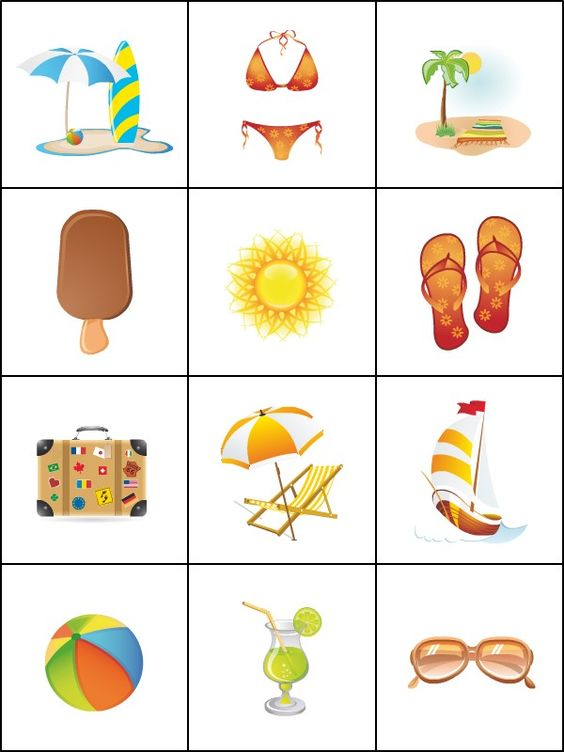

# Memory-Card-Game

This is a simple memory card game implemented using HTML, CSS, and JavaScript. 
The game involves matching pairs of cards with identical images.

## How to Play

1. Click on any card to flip it over.
2. Try to match pairs of cards with identical images.
3. If you match all the pairs, a congratulatory image will appear to celebrate your victory!

## Features

- **Card Matching**: Flip cards to find matching pairs.
- **Responsive Design**: The game is designed to work on various screen sizes.
- **Congratulatory Image**: When all cards are matched, a congratulatory image will pop up in the middle of the screen.

## File Structure

- `index.html`: The main HTML file containing the structure of the game.
- `styles.css`: The CSS file containing the styles for the game.
- `script.js`: The JavaScript file containing the game logic.
- `package.json`: The JSON file containing the image data for the cards.

## How to Play

1. Open `index.html` in a web browser.
2. Click on a card to flip it.
3. Click on another card to try to find a match.
4. If the cards match, they remain flipped. If not, they flip back.
5. Continue until all pairs are matched.

## Installation

1. Clone the repository or download the zip file.
2. Ensure you have a web server running (e.g., using VS Code Live Server, or a local server).
3. Open `index.html` in your web browser to start the game.

## JavaScript Code Explanation

### Variables

- `matched`: Tracks the number of matched pairs.
- `disableDeck`: Prevents interaction with the deck while cards are being flipped.
- `cardOne`, `cardTwo`: Track the two cards currently being compared.
- `cards`: NodeList of all the cards in the game.

### Functions

#### `shuffleCard()`

Initializes the game by fetching data from `package.json`, shuffling the cards, and setting up the event listeners for card clicks.

#### `flipCard(e)`

#### `matchCards(img1, img2)`

Checks if the two flipped cards match. If they do, it increments the `matched` counter. 

### Adding Event Listeners to Cards

Each card gets a click event listener to handle the flip logic.

